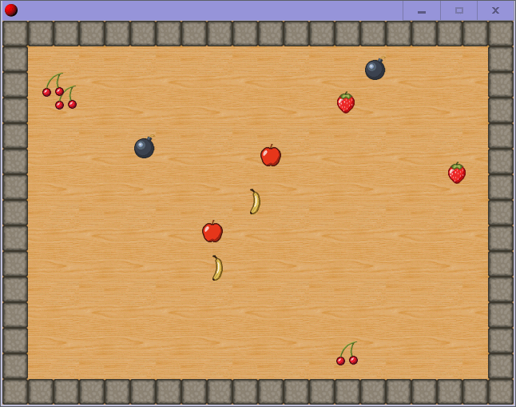
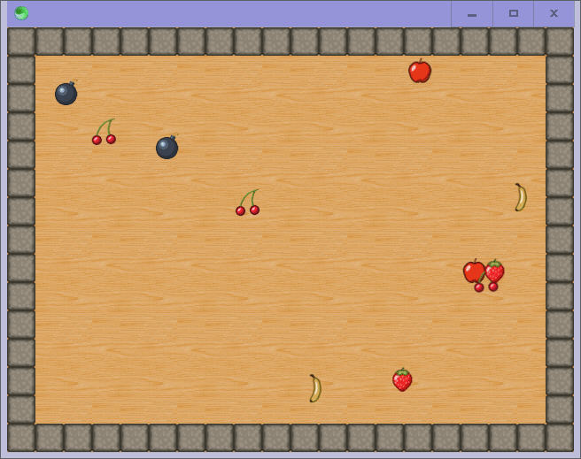

## Improved version in the works here:

- https://github.com/GirkovArpa/JogoMaker

__________

**GameMaker 8.1** comes with a demo game file called `tutorial1.gmk`.  When run, it looks like this:

This repo is an attempt at remaking it in Sciter (as a proof-of-concept):

## Note

This is not just a remake of the game `tutorial1`, but a remake of the **GameMaker** engine itself.  Although, it's lacking the UI.